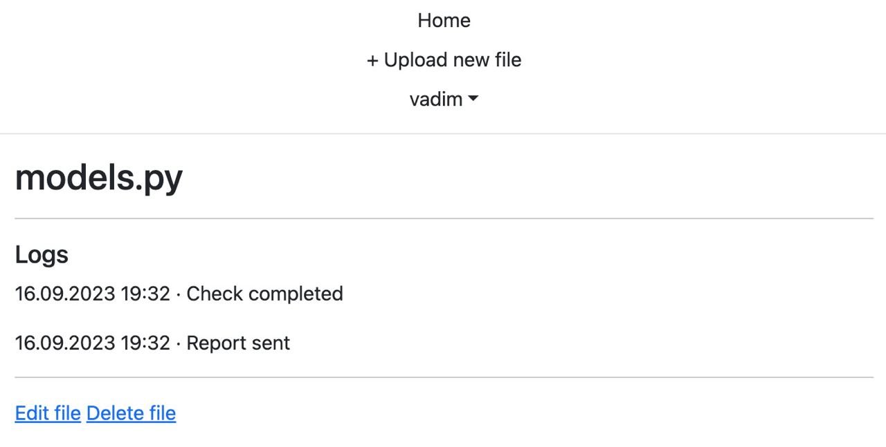

# Cервис проверки файлов
Разработанный на Django сервис для загрузки и проверки файлов .py с регистрацией и авторизацией пользователя, отложенным запуском проверки и отправкой результатов на почту с использованием Celery/Redis.

Каждые 5 секунд Celery Beat запускает задачу start_run_checks, которая отбирает загруженные/измененные файлы и формирует задачи process_file.
Задача process_file имитирует обработку файла и формирует задачу send_report с результатом обработки.
Письма сохраняюится в файлы в папке /tmp/messages.

## Конфигурация
Конфигурация в `src/.env`, пример `src/.env.example`

## Установка
```bash
cp src/.env.example src/.env  # default environment variables
mkdir ./tmp/messages1 #create folder for emails
mkdir ./src/logs #create folder for celery logs
docker-compose up -d
```

## Запуск тестов
```bash
make test
```

## Интерфейс
Список загруженных файлов


Отчет проверки файла



Письмо с результатом проверки


Мониторинг в Flower

